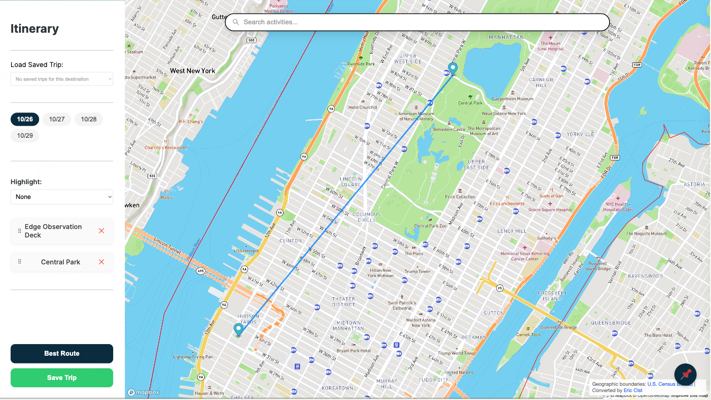

# Sprint 7: Pathfinding

### Task A: Code Walk
#### Core Components
1. **Graph Data Structure**
- Defined in `graphSchema.ts`:
  - `GraphNode`: Represents points with latitude/longitude coordinates
  - `GraphEdge`: Represents weighted connections between nodes
  - `GraphTile`: Contains nodes and adjacency lists for a geographic region

2. **Tile Management System**
- The map is divided into tiles (0.1 degree squares)
- `tileUtils.ts` manages:
  - Coordinate to tile key conversion
  - On-demand graph data loading
  - Geographic distance calculations using Haversine formula

3. **Data Flow**
```
Frontend Request → /find-path endpoint
  ↓
handleShortestPathRequest():
  1. Load required map tiles
  2. Find nearest nodes to start/end points
  3. Execute routing algorithm (A*/Dijkstra)
  4. Convert node IDs back to coordinates
  ↓
Frontend receives path coordinates
```

#### Integration Points

The backend exposes a RESTful endpoint `/find-path` that accepts:
```typescript
POST {
  points: [
    { lat: number, lng: number },  // start
    { lat: number, lng: number }   // end
  ]
}
```

And returns:
```typescript
{
  path: [
    { lat: number, lng: number },  // waypoints...
  ]
}
```

### Task C: Design And Prototyping
#### Route Search Implementation Plan

##### Overview
The route search feature will find optimal paths between activities using A* pathfinding with lazy loading of map data. This approach balances performance and memory usage by only loading map tiles as needed during the search.

##### Technical Architecture

###### 1. Data Structures
```typescript
interface MapTile {
  id: string;               // Tile identifier (e.g., "lat_lng")
  nodes: GraphNode[];       // Nodes within this tile
  edges: GraphEdge[];       // Edges connecting nodes
  bbox: BoundingBox;        // Tile boundaries
  loaded: boolean;          // Lazy loading status
}

interface GraphNode {
  id: string;
  lat: number;
  lng: number;
  edges: string[];         // Adjacent edge IDs
}

interface GraphEdge {
  id: string;
  start: string;          // Start node ID
  end: string;            // End node ID
  weight: number;         // Distance/time cost
  metadata?: any;         // Optional street/path info
}
```

###### 2. Core Components

**TileManager (Existing)**
- Manages the lifecycle of map tiles
- Implements lazy loading strategy
- Key methods:
  ```typescript
  async loadTile(lat: number, lng: number): Promise<MapTile>
  unloadTile(tileId: string): void
  getTileForCoordinate(lat: number, lng: number): string
  ```

**PathFinder (New)**
- Implements A* algorithm with tile-aware searching
- Key methods:
  ```typescript
  async findPath(start: Coordinate, end: Coordinate): Promise<Path>
  private async expandNode(node: GraphNode): Promise<GraphNode[]>
  private estimateDistance(a: Coordinate, b: Coordinate): number
  ```

###### 3. Lazy Loading Strategy

The system will:
1. Start with empty tile cache
2. Load tiles on-demand when:
   - Search enters a new geographic area
   - Expanding nodes near tile boundaries
3. Implement LRU cache for tiles:
   - Keep recently used tiles in memory
   - Unload least recently used when memory threshold reached

```typescript
class TileCache {
  private cache: Map<string, MapTile>;
  private lruList: string[];
  private readonly maxSize: number;

  async getTile(id: string): Promise<MapTile> {
    if (!this.cache.has(id)) {
      await this.loadTile(id);
      this.maintainCacheSize();
    }
    this.updateLRU(id);
    return this.cache.get(id)!;
  }

  private maintainCacheSize(): void {
    while (this.cache.size > this.maxSize) {
      const oldest = this.lruList.pop()!;
      this.cache.delete(oldest);
    }
  }
}
```

###### 4. A* Implementation Plan

1. **Initialize Search**
   ```typescript
   async function findRoute(start: Coordinate, end: Coordinate): Promise<Path> {
     const startTile = await tileManager.loadTile(start.lat, start.lng);
     const startNode = findNearestNode(startTile, start);
     
     const openSet = new PriorityQueue<GraphNode>();
     const closedSet = new Set<string>();
     
     openSet.add(startNode, 0);
     const gScore = new Map<string, number>();
     gScore.set(startNode.id, 0);
   }
   ```

2. **Expand Nodes**
   ```typescript
   private async expandNode(current: GraphNode): Promise<GraphNode[]> {
     const neighbors: GraphNode[] = [];
     
     for (const edgeId of current.edges) {
       const edge = await this.getEdge(edgeId);
       const neighborId = edge.end === current.id ? edge.start : edge.end;
       
       // Load new tile if neighbor is in different tile
       const neighborTile = this.getTileForNode(neighborId);
       if (!neighborTile.loaded) {
         await tileManager.loadTile(neighborTile.lat, neighborTile.lng);
       }
       
       const neighbor = await this.getNode(neighborId);
       neighbors.push(neighbor);
     }
     
     return neighbors;
   }
   ```

3. **Heuristic Function**
   ```typescript
   private estimateDistance(a: Coordinate, b: Coordinate): number {
     // Haversine distance plus additional cost estimates
     const baseDistance = haversine(a, b);
     const urbanityFactor = this.estimateUrbanDensity(a, b);
     return baseDistance * urbanityFactor;
   }
   ```

#### Memory Management

To prevent memory issues with large maps:

1. **Tile Size Optimization**
   - Each tile covers 0.1° × 0.1° area
   - Approximately 11km × 11km at 40° latitude
   - Average tile size: ~500KB-2MB depending on density

2. **Cache Strategy**
   - Keep maximum of N tiles in memory (N based on available RAM)
   - Prioritize tiles along the current search frontier
   - Unload tiles far from current search area

3. **Search Space Pruning**
   - Use geographic bounds to limit search area
   - Ignore tiles clearly outside reasonable path
   - Cache frequently used paths between popular locations

#### Visual Prototype



### Task D: Communicating Concerns

#### Step 1: Concerns Summary

##### 1. Data Use Concerns
- **Violation of FBI Data Usage Guidelines**: The FBI's Uniform Crime Reporting (UCR) Program explicitly prohibits using arrest data to rank or compare geographic areas. The FBI warns that such comparisons "provide no insight into the numerous variables that shape crime in a particular community" and "often create misleading perceptions that adversely affect communities and their residents."
- **Potential Consequences**:
  - API Access Loss: The FBI could revoke our access if they detect misuse
  - Legal Liability: Users might make harmful or discriminatory decisions based on misleading visualizations that could lead to legal consequences.
  - Reputational Damage: Experts could publicly criticize our misuse of official data

##### 2. Metric Choice Concerns
- **Statistically Invalid Safety Metric**: The proposed formula—arrests divided by population—is not a valid measure of safety. Arrests reflect policing activity, not actual crime rates or personal risk, meaning it could show corelationship but not causation. 
- **Confounding Factors**:
  - Reporting Inconsistency: UCR participation is voluntary and uneven; missing data falsely appear as "zero arrests"
  - Population Mismatch: Tourist destinations and college towns have transient populations not captured in census data
  - Jurisdictional Overlap: City, county, and federal agencies report differently, often across inconsistent boundaries
  - Bias and Context: Enforcement priorities and systemic bias can inflate or suppress arrest counts independently of crime

##### 3. User Interface Concerns
- **Misleading Visualization**: The current approach could lead to labeling well-policed urban areas as "dangerous" while showing under-resourced rural areas as "safe"
- **Potential for Digital Redlining**: Such distortions could perpetuate digital redlining, harm community reputations, and mislead users into discriminatory or unsafe choices

#### Step 2: Alternative Metrics

Instead of using arrest data as a proxy for safety, we could consider the following alternative metrics:

1. **Community-Reported Perception Data**
   - **Description**: Survey data from residents about their perception of safety in their neighborhoods, colleges, or tourist destinations(But this requires a large amount of data collection and analysis for each area)
   - **Implementation**: Partner with organizations that conduct regular community surveys or implement our own lightweight survey system
   - **Advantage**: Captures lived experience rather than enforcement statistics, which can be more representative of community concerns

2. **Multi-Factor Safety Index**
   - **Description**: A composite score combining multiple data sources (street lighting, emergency response times, walkability scores, etc.)
   - **Implementation**: Create a weighted algorithm that incorporates various public datasets with transparent methodology
   - **Advantage**: Provides a more holistic view of factors that contribute to safety

3. **Contextual Safety Information**
   - **Description**: Qualitative information about an area's safety characteristics without numerical ranking(But this requires a large amount of data collection and analysis for each area as well)
   - **Implementation**: Curate information about area-specific safety considerations (e.g., "busy tourist area with pickpocketing concerns" or "residential area with school zones")
   - **Advantage**: Avoids misleading quantification while still providing useful information

4. **User-Generated Safety Tips**
   - **Description**: Community-sourced information about safety considerations for specific locations, which could be something like yelp reviews or local forums. We can build a online community for each area/tourist destination.
   - **Implementation**: Allow verified users to submit location-specific safety tips that are moderated and displayed contextually
   - **Advantage**: Leverages local knowledge while avoiding official "safety ratings"

#### Step 3: UI Design Considerations

To avoid miscommunication with users regarding safety information, our UI design should prioritize several key principles. First, we should incorporate educational context throughout the interface by including clear explanations about the limitations of safety data, providing tooltips or information panels that explain what factors are (and aren't) included in any safety-related information, and adding disclaimers about the proper interpretation of the data. Second, we must avoid simplistic visual encoding by removing color-coding that suggests binary safe/unsafe distinctions (e.g., red/green), replacing simplistic "safety scores" with more nuanced information displays, and using design patterns that communicate complexity rather than certainty.

Additionally, the interface should provide multiple perspectives by showing different types of contextual information side-by-side rather than a single safety metric, allowing users to toggle between different information layers to understand various aspects of an area, and including timestamps and source information for all data to indicate recency and reliability. Finally, we should emphasize user control and transparency by allowing users to customize what safety-related information they see, providing clear attribution for all data sources, and including links to methodology explanations for any derived metrics. These design considerations would help users understand the nuanced nature of safety information and avoid drawing potentially harmful conclusions from oversimplified data.

#### Step 4: Email Draft

```
Subject: Concerns and Alternatives for the Safety Visualization Feature

Dear Project Manager,

I'm writing regarding the requested feature to visualize "safety" using FBI arrest data divided by population. After careful technical and ethical review, our team has identified several critical concerns with this approach:

1. **Violation of FBI Data Usage Guidelines**: The FBI explicitly prohibits using UCR arrest data to rank or compare geographic areas. Implementing this feature as requested could jeopardize our API access and create legal liability.

2. **Statistical Invalidity**: Arrest rates primarily reflect policing activity and resource allocation, not actual safety. Factors like reporting inconsistency, population fluctuations, and jurisdictional differences make geographic comparisons misleading.

3. **Potential Harm**: This visualization could inadvertently perpetuate biases, harm community reputations, and mislead users into making discriminatory or unsafe choices.

We propose the following alternatives that would better serve our users while avoiding these issues:

- Implement a multi-factor safety index that incorporates diverse public datasets (street lighting, emergency response times, walkability)
- Provide contextual safety information without numerical ranking
- Design UI elements that communicate nuance rather than simplistic "safe/unsafe" distinctions
- Include clear educational context about data limitations

Our team can prepare a detailed proposal with mockups for these alternatives within one week. We believe these approaches would provide more value to users while aligning with ethical data practices.

Could we schedule a brief meeting to discuss these concerns and alternative approaches before proceeding with implementation?

Best regards,
Yanmi Yu & Rui Zhou
```

### Design Choices

#### Errors/Bugs:
#### Tests:
#### How To…

##### Yanmi Yu
I implemented the pin removal functionality that deletes pins from both the pin folder and all trips. This enhancement ensures that when a user removes a pin from their collection, it's completely removed from the system - both from the pins folder and from any trips it was added to. The implementation includes:

1. A new frontend service method `removePinFromEverywhere` in PinFolderService
2. A new backend endpoint `/pins/:userId/:pinId/everywhere` that handles removing pins from both collections
3. Updated UI logic to immediately reflect pin removal in both the pin folder and itinerary displays

I also fixed the pin synchronization issue where pins deleted from trips weren't being properly removed from the pin folder, and implemented automatic refreshing of the Pin Folder when trips are saved or updated.

Additionally, I made the following improvements:

1. Fixed the "Add to day" button in the Pin Folder by updating the `addPinToItinerary` function to include the user ID in the request body
2. Converted the "📌 Saved" and "To Save" buttons into non-interactive status indicators to improve user experience
3. Enhanced the pin synchronization system to ensure the pins collection in Firebase always contains only the unique set of pins from all of a user's saved trips
4. Modified the `/pins/sync/:userId` endpoint to completely replace existing pins with the unique set from all trips, ensuring pins are properly removed when they're no longer in any trips
5. Updated the trip save/update functionality to automatically trigger pin synchronization, maintaining data consistency across the application


##### Rui Zhou


#### Team members and contributions (include cs logins):
Yanmi Yu(yyu111): Task B.1, Task D, Supplement
Rui Zhou(rzhou52): Task A, B.2, Task C
#### Collaborators (cslogins of anyone you worked with on this project or generative AI):

Claude 3.7/ChatGPT4: explianing code functionality when starting, idea inspriation, Task A-D and supplement, generate a set of example code for keyboard, generate example code for firebase integration, syntax check, debug logic, comments. 

##### Previous sprint contributor 
Sprint 3:
sjung03: Task 2, User story 2, race condition reflections
yyu111: Task 1, User story 1, Task 3, your learning reflections, supplemental challange(only Mia register for grad level)
Sprint 4:
sjung03: User story 2, User story 1 related tests,
yyu111: User story 1, User story 1 related tests, supplemental challange(only Mia register for grad level)
Sprint 5:
Yanmi Yu (yyu111): Task 1, Task 3, Meta Reflection marked for Yanmi
Zihan Wang (zwang685): Task 2, Supplement, Meta Reflection marked for Zihan
Coprogram: task 3 and supplement
Sprint 6:
Yanmi Yu(yyu111): task 1, task 2.2
Zihan Wang(zwang685): task 2.3, task 3
Coprogram: task 4, supplemental challenge

##### Sprint 7:
Yanmi Yu(yyu111): Task B.1, Task D, Supplement
Rui Zhou(rzhou52): Task A, B.2, Task C

#### Total estimated time it took to complete project:
#### Link to GitHub Repo:  
#### Link to asynchronous demo:


